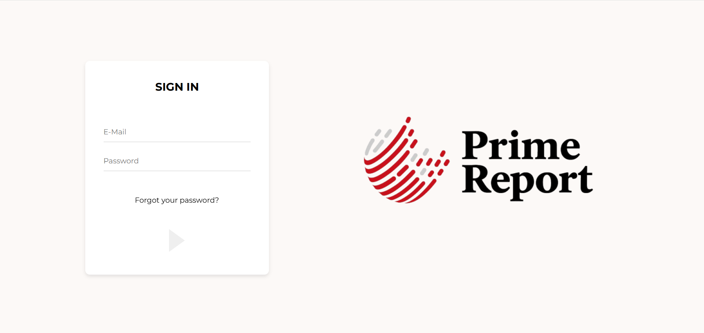

# Report Management System

A lightweight daily report & hours tracking app with role-based dashboards, department analytics, and company-wide insights. Built with React + Vite on the frontend and Go (Gin) + MongoDB on the backend. Deployed on Vercel (FE) and Render (BE).


Superadmin + per department Admin/Employee demo accounts are already provisioned on the live server use them to try the app end-to-end.

🌐 Live on vercel: [report-management-system](https://report-management-system-one.vercel.app)

Demo Credentials (pre-created)

```powershell

Superadmin
  email: superadmin@example.com
  password : 123

Admin (e.g., Sales)
  email: sales.admin@example.com
  password : 123

Employee (e.g., Sales)
  email: sales.employee01@example.com
  password : 123

```


<table>
  <tr>
    <td></td>
  </tr>
</table>


---

## Features 

- **Daily Reports**: Employees submit hours + text content per day.

- **Smart Search**: Full-text search across report content; filter by department/date.

- **Employee Management**: Status per day (“Report Submitted” / “No Report”), recent history, inline preview.

- **Department Analytics**: Time-series charts (7d, 30d, 6m, 12m), totals, averages, top contributors.

- **Compare Employees**: Multi-series trend lines to compare contributors within a department.

- **Company Overview (Superadmin)**: Global stats + department overview (employees, reports today, avg hours per selected period) and department comparison charts.

- **Reminders/Messages**: Send department-targeted or org-wide announcements; auto-expire.

- **Export**s: One-click export (CSV/PNG) for charts (front-end option).(!!! this feature is currently not working properly.)

- **Role-Based Access Control**: Superadmin / Admin / Employee, with clear, scoped permissions.

- **SPA-safe Routing**: Production rewrite rules so deep links/refreshes work.


---


## Roles & Permissions

### Superadmin

  - See company-wide overview, analytics, and comparisons across **all departments**.
  
  - Switch department context in analytics.
  
  - Manage reminders company-wide.
  
  - Add users (single or CSV) **with any role (admin/employee)** to **any department**.
  
  - Browse all employees by department; preview recent reports.
  
  - No “My Activity” section (since superadmin doesn’t submit reports).

### Admin (per-department)

  - Full analytics **for their department** (hours trends, stats, top contributors).
  
  - Compare employees **within their department**.
  
  - Browse and manage employees **within their department**.
  
  - Create reminders to their department.
  
  - Add employees (single/CSV) **as employees** into their department.
  
  - Has personal daily report flow (write/edit/search own reports).

### Employee

  - Submit/edit daily reports (hours + content).
  
  - View personal history and basic analytics (“My Activity”).
  
  - Read department reminders.


---

## Tech Stack

### Frontend
  
  - React + Vite
  
  - React Router
  
  - Recharts (charts)
  
  - Lucide React (icons)
  
  - anilla/CSS modules (custom styles)
  
  - Small toast system (global notifications)

### Backend

- Go (Gin)

- MongoDB (official Go driver)

- JWT (golang-jwt)

- bcrypt (password hashing)

- CORS, dotenv

Infra (deployment + db)

- Vercel (frontend)

- Render (backend)

- MongoDB Atlas


---

## Local Development

### Prerequisites

- Node 18+

- npm / pnpm / yarn

- Go (match your go.mod; Go 1.22+ recommended)

- MongoDB (Atlas or local)

### Environment Variables

Create these files:

frontend/.env

```powershell

 VITE_API_URL=http://localhost:5000/api

```


backend/.env

```powershell

    PORT=5000
    MONGO_URI=mongodb+srv://<user>:<pass>@<cluster>/<db>?retryWrites=true&w=majority
    JWT_SECRET= <create yours>

```

> Tip: Commit frontend/.env.example and backend/.env.example with placeholders; keep real .env files out of Git.


